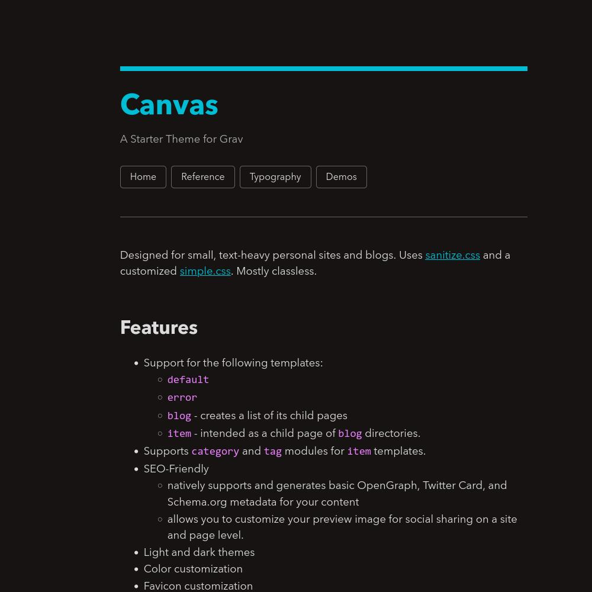

# Canvas Theme

A starter theme for Grav CMS. Designed for small, text-heavy personal sites and blogs. Uses [sanitize.css](https://csstools.github.io/sanitize.css/) and a customized [simple.css](https://simplecss.org/). Mostly classless.



## Features

- Support for the following templates:
	+ `default`
		* aliases: `page`
	+ `error`
	+ `blog` - creates a list of its child pages
		* aliases: `folder`, `archive`, `index`
	+ `item` - intended as a child page of `blog` directories.
		* aliases: `post`, `article`
	+ `form`
- Supports `category` and `tag` taxonomies for `item` templates.
- SEO-Friendly
	+ natively supports and generates basic OpenGraph, Twitter Card, and Schema.org metadata for your content
	+ allows you to customize your preview image for social sharing on a site and page level.
- Light and dark themes
- Color customization
- Favicon customization
- Switch navigation between the header and footer.

## Plugin Requirements

- Grav >= 1.7
- Sitemap
- Feed
- Form
- Admin
- Pagination
- Breadcrumbs

Note: Support for `feed` and `form` is still basic and will be improved in the future. `blog` templates must explicitly define `content.item` attributes in their frontmatter for the feed to show. See [feed plugin repo](https://github.com/getgrav/grav-plugin-feed) for more details.

## Installation

The recommended way to install Canvas is via cloning the [repository](https://github.com/acezalba/canvas.git) or downloading and extracting the latest [zip file](https://github.com/acezalba/canvas/archive/refs/heads/main.zip) to your `user/themes` directory. Canvas also has [releases](https://github.com/acezalba/canvas/releases) for future integration into Grav Package Manager.

Activate it by editing or adding the following line in your `user/config/system.yaml`.

```yaml
pages:
    theme: canvas
```

Clear your cache via the Admin panel or through `bin/grav cache` in your project terminal. Load your page to see your Canvas site come to life.

Copy the default `canvas.yaml` bundled with the theme to your `user/config/themes` to start customizing the colors of your site using hex codes.

However, editing the theme settings via the Grav Admin panel is recommended to use features not included in the default theme config file, such as favicon and preview image customization.